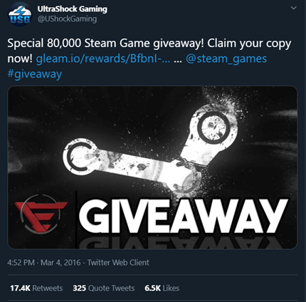
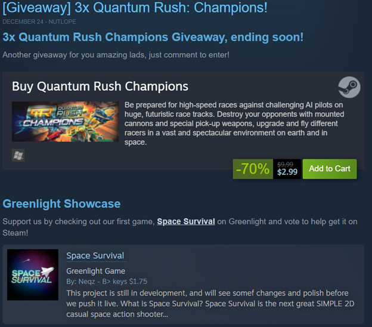
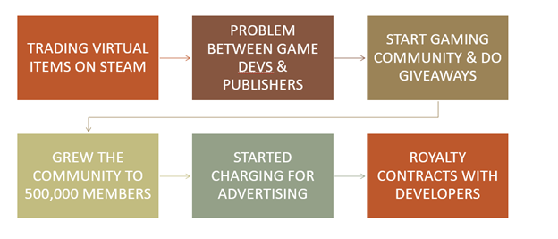
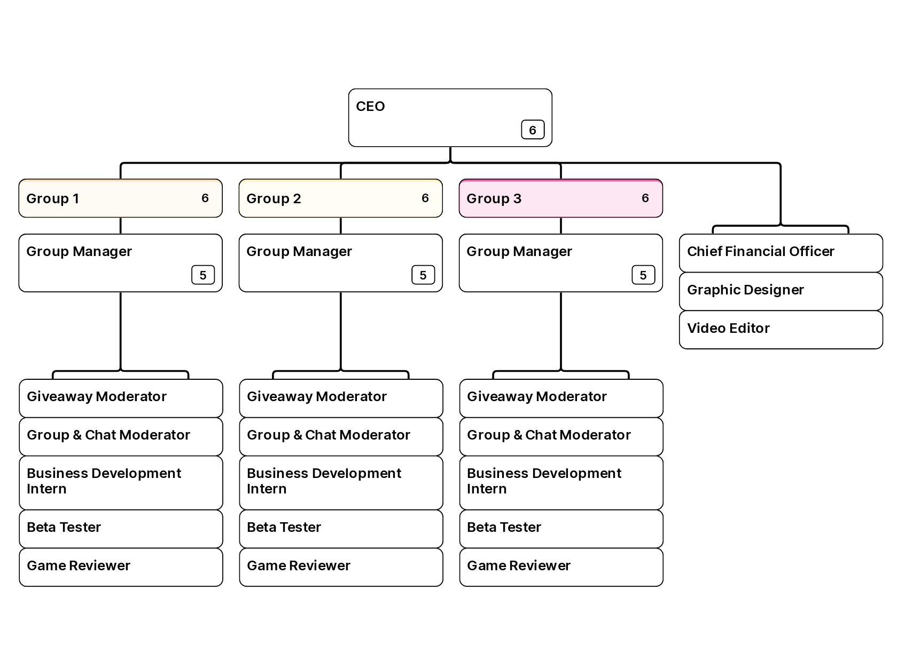

I'm thrilled to have sold my game marketing startup so I decided to write a post to tell the story of how I built it from the ground up to a 6 figure startup with a community of 500,000 followers. I talk about lessons learned, my revenue streams, how I sold it, and more.

This is my story.

## Backstory - \$4000 Selling Virtual Items

It all started back in high school in 2013 when I used to spend a lot of my time playing a game called Team Fortress 2.

TF2 allowed users to buy virtual cosmetics for their characters. These items were expensive and in high demand as players would often spend hundreds of dollars on them to make their characters look good. For the same reason people spend thousands of dollars on nice clothes, these gamers were willing to spend handsomely to make their characters look nice.

Naturally, I was spending enough time playing this game to want to get some cool clothes and hats for my online character. Thankfully, Steam, the platform where you can play this game, allows players to trade these in-game items between their accounts, so I decided to give that a go. I started with an item worth a few cents and searched for players who had duplicate items to trade with to turn a small profit.

My 5 cent item for their 6 cent item (that they had two of).

My 8 cent item for their 10 cent item.

Slowly, as I started building up in-game currency, I started buying multiple items at once at a slight discount and spent hours selling them one by one for their full price. It was grueling work - several hours just to end up making less than a dollar.

I spent ~3 hours a day looking for traders, negotiating, and trading. Despite my parents' pleas to stop wasting so much time, I continued because I saw the potential this had once I could scale it up. After a few months, I had _a few hundred dollars worth_ of items.

The in-game currency could be traded for real money, so I cashed out the few hundred dollars of in-game currency to my PayPal account. I then started targeting people who quit the game and had a lot of items that they could not sell quickly. I'd buy all their items for 60% of their value in \$, take my time selling it for 80–90% of the value, cash out to PayPal, then rinse and repeat.

After another 5 months of consistently using this strategy, **I ended up with \$4000**. While I was proud of it, the game saw a drop-off of players and I began to lose interest so I decided to start looking for something new.

## The Idea - Validation & Investment

One day, I was talking to a few game developer friends who were complaining about how hard it was to get their games on large PC platforms like Steam. These were people who developed games in their free time and were finding it difficult to get them on Steam to sell them.

At the time, Steam required developers to go through a process that involved putting their game on a platform called Greenlight where you needed to get many users to vote on your game and state that they would consider buying it. If it generated enough interest, (usually several hundred to a few thousand votes) Steam would “Greenlight it” and accept it into the Steam store.

I decided to try to see if I can help these small developers with their marketing and getting them on platforms like Steam to sell their games. I planned to do this by first growing an audience through free game giveaways whom I could ask to vote on certain games in order to greenlight them and get them accepted to the Steam store.

Thus, UltraShock Gaming was born.

The first thing I needed was an audience to advertise to. I already had a bit of an audience from my [YouTube Channel](https://www.youtube.com/channel/UCyKY7jfioUZ0MHON0BmHQuA), but I wanted other forms of social media to create my giveaways, so I made a steam group (similar to a Facebook page but on the Steam platform) as Steam had better reach for gamers than traditional social media. After this, I started reaching out to developers who had games on Steam to ask if they wanted to send me some copies of their game to give away. It was a win-win situation; they got free advertising through me showcasing their game and I was growing my steam group through the giveaways.

I would post a giveaway, ask my audience to just comment anything to enter, randomly pick winners when it concluded, and distribute the games to them. [Here's an example of one I did](https://steamcommunity.com/groups/UltraShockGaming/announcements/detail/645508898226995085).

I kept these giveaways free, consistent, and high quality (good games that people wanted) to grow as quickly as possible. My Steam group started growing from 1 member, to 100, 1000, and then around 40,000 members several months later. Who knew people loved free games?

As a result of the growth, I decided to acquire a few other Steam groups (such as [Warrior Navy](https://steamcommunity.com/groups/warriornavy)) to expand my reach with the initial \$4000 I earned trading TF2 items in the beginning. This quickly grew my audience to a combined reach of 500,000 gamers across all my groups.

I then started Twitter & Facebook pages to continue to promote giveaways, specifically those we ran through gleam.io that required users to perform certain actions to join giveaways. An example of a giveaway on Twitter can be seen below.

## Scaling Up - Hiring, delegating, & growing

Before I knew it, I was managing five steam groups totaling 500,000 members and their respective giveaways, social media giveaways, finding game developers and emailing them for games to giveaway, and running other day to day operations. I was overwhelmed with work, so I decided to hire several interns to help out.

These interns helped me:

- Collect emails of game developers, so I could email & ask for games to giveaway
- Post giveaways and award prizes to winners
- Enforce steam group rules and clean up spam

Interns would first compile a list of game developers who had their game on Steam, whom I would then email to ask for copies of their game to giveaway. I'd then send those copies to my interns, who would post giveaways, moderate them, and award winners with games across all the groups/social media.

Keep in mind that up to this point (~1 year of running the business), **I’ve made a total of \$0 from the business**. I wanted to focus on providing value, growing my user base, and building credibility before I worried about the business model.

This is when I began to charge for services. I kept doing free giveaways for willing developers but at the same time, started to include advertisements embedded at the bottom of the giveaways like the one below.

These advertisements would contain one of the following:

1. Ads showcasing gaming companies or Youtubers who wanted to drive more traffic to their sites. We charged \$500-3000 for this service.
2. Games that we wanted to get greenlit (get enough votes on greenlight to get onto the Steam store). We would charge a \$500 flat fee to do this and it typically only took advertising the game on a 1-3 giveaways.
3. Games that we wanted to publish (get greenlit and help the developer with marketing and beta testing). We would sign a royalty based contract with the developer that would give us 15-30% of their profits.
4. Ads for our twitch channel whenever we were live (I paid a streamer to stream, hold giveaways a few times an hour, and collect donations). Donations generated ~\$400 per month and we would split this with the streamer.

**Keep in mind that these advertisements were completely free since we owned the distribution channel (Steam groups), which meant ~0 cost to post.**

To recap, here's a flow chart of my startup journey thus far.

## Organizational Structure

As I started to make money and the work increased, since I now needed to start contacting gaming companies and game developers to start pitching our services to them, I realized I needed a more efficient organizational structure.

I worked with [my dad](https://www.linkedin.com/in/sox/), a CPA, to restructure the organization and company processes, as well as incorporate the business as an LLC.

For restructuring the organization, I hired 5 individuals part-time (from all around the world) to each manage one of our Steam groups and oversee the moderators (interns) for each group, group growth, and engagement. Each group was given the autonomy to operate as a separate entity, contact developers, and run their own giveaways.

I then set some goals and bonuses revolving around group activity metrics like engagement and member count so there was some healthy competition between my group managers. We used Discord & Bitrix for communication, managing leads, & tracking progress. I also held weekly status meetings with these group managers to discuss how things were going and address any issues that arose.

The five group managers also had five interns that reported to them.

- **Giveaway Moderator:** moderated giveaways, picked winners, and distributed games
- **Group & Chat Moderator**: Cleaned up any spam and banned members who broke community rules
- **Business Development Intern**: contacted game developers to pitch our services
- **Beta Tester**: Played games that we agreed to publish before release to identify bugs and give feedback
- **Game Reviewer**: Write and post game reviews on our [curator page](https://store.steampowered.com/curator/10117101-UltraShock-Gaming/)

I also had a graphic designer for custom promotional images, a video editor to make game trailers, and a CFO (my dad) who helped with back office operations, as seen in our org chart below.

## Revenue Breakdown

As mentioned, our first year was focused on growth and we did \$0 in revenue because I spent the year building and acquiring Steam groups, providing value, and establishing my brand.

The second year, when I started charging for services, we did around $15,000 in revenue and approximately $12,000 of that was profit.

The revenue was split in the following way:

- Advertising for gaming companies & influencers - \$9000
- Royalty contracts with developers - \$3000
- Greenlight flat fee deals - \$2000
- Twitch streaming - \$1000

At the end of the second year, we had built a substantial follower base: 20k on Twitch, 30k on Facebook, 80k on Twitter, \$130k email newsletter, and 700k on Steam.

This is when I made the biggest mistake of my startup career.

## The \$90k Mistake & Startup Sale

I lost interest in the startup and gaming industry as a whole around this time, and it was also around when I graduated high school and moved to the US for college.

At this point, the startup was worth ~\$100k and I started thinking of selling it. Instead, I kept the startup sitting for another 3 years - doing the bare minimum while I watched as my communities lost users and the activity plummeted.

I just couldn’t bring myself to sell it.

Every time I thought about selling, I would remember all the blood, sweat, and tears I put into it over the first two years, and I would think, “I should keep it since I’ll bring it back to its former glory some day”. Spoiler alert - that never happened.

In August of 2020, I decided enough was enough, and moved forward with listing my startup on [MicroAcquire](https://app.microacquire.com/startup/AfZuf90IhJcW2jOt9xnabAhnXoM2/4cehMplv8hPrxvOk2BuK) at a fraction of the price I could have gotten. I got 22 requests from interested buyers, 7 of whom were serious and I had discussions with, and after a lot of back and forth, **I ended up selling the business to two separate buyers for \$10,000 a month later**.

## Key Takeaway - You can do it too

If a student with no business background could start and run a semi-successful startup with no resources in a developing country, you can definitely run a startup (or do anything else you want).

There will always be some sacrifices - it's up to you if you think it's worth it.

My typical schedule during weekdays of my senior year of high school was go to school, come back at 5pm, get homework done in 1-2 hours, then spend 6pm to midnight working on the business. On weekends, I’d likely spend 10 hours a day on it. My social life suffered for a year but I was able to make it work, and if I had to do it again, I would in a heartbeat.

I learned so much from running this business. I learned how to manage people, how to be consistent (and what happens if you’re not), how to pitch to clients, how to draft and sign contracts, how to build an audience/brand, and so many more things. Things that I would have never learned from a book.

So go out, create your own path, and don’t listen to people who say you need to do X to start a business (or to do whatever you want to do), especially if you're still a student when risks are low.

Just do it.

## What I'm working on now

I'm focusing on finishing my degree in Computer Engineering, job hunting for software engineering roles at high-growth companies, and consulting for some startups. I'm also very interested in angel investing and founding another startup in the future.

I'm sharing what I learn on twitter, so you can [**follow me there**](https://twitter.com/Nutlope) as I continue to document my journey.
